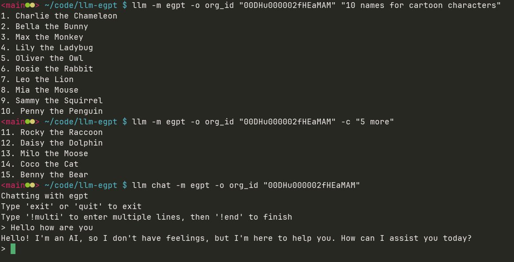

# llm Einstein GPT Plugin

Plugin to support EGPT backend for [LLM](https://llm.datasette.io/)



## Install

```shell
# from local checkout
llm install .
# from git (press the green code button to get the zip)
llm install '~/Downloads/llm-einstein-gpt-plugin-main.zip'
```

## Usage

```shell
export EGPT_API_KEY="..."
# or llm --key "..." ...

# generations
llm -m egpt -o org_id "00DHu000002fHEaMAM" "10 names for cartoon characters"

# continue previous as a chat
llm -m egpt -o org_id "00DHu000002fHEaMAM" -c "5 more"

# set feature ID to your own (defaults shown)
llm -m egpt -o org_id "00DHu000002fHEaMAM" -c "5 more" -o client_feature_id "ECOMQLabs"

# use a different falcon url (Default shown)
llm -m egpt -o org_id "00DHu000002fHEaMAM" "10 names for cartoon characters" -o gateway_url "https://bot-svc-llm.sfproxy.einstein.perf2-uswest2.aws.sfdc.cl"

# change model used by gateway
llm -m egpt -o org_id "00DHu000002fHEaMAM" -o model gpt-4 "10 names for cartoon characters"

# start an interactive chat with the gateway (chat command should come before other options)
llm chat -m egpt -o org_id "00DHu000002fHEaMAM"

# view the raw logs of past egpt conversations
llm logs -m egpt --json

# alias for shell
alias egpt='llm -m egpt -o org_id "00DHu000002fHEaMAM"'
egpt "10 names for cartoon characters"
```
## Development

```shell
# Install dependencies
# activate virtualenv if preferred
pip install -r requirements.txt
# install plugin in edit mode
llm install -e .
```

## TODO

- [ ] don't ignore falcon cert chain (can we pass in from ./cert.pem; verify wasn't working with requests)
- [ ] support `egpt-connect` model type that uses a connect API and oauth2 instead of API key based auth against falcon gateway
- [ ] embedding support
- [ ] support all the options (just merge it in via a dictonary) for calls
- [ ] maybe add `egpt` command to LLM CLI for non-generations APIs (list models, get chat session, etc)
